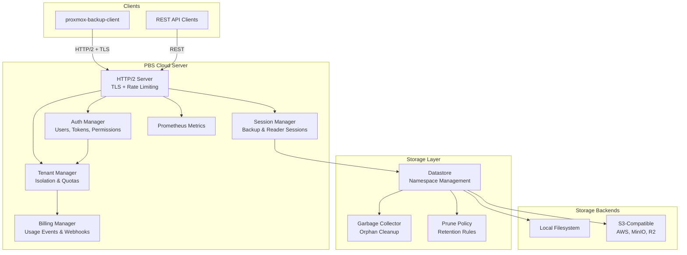
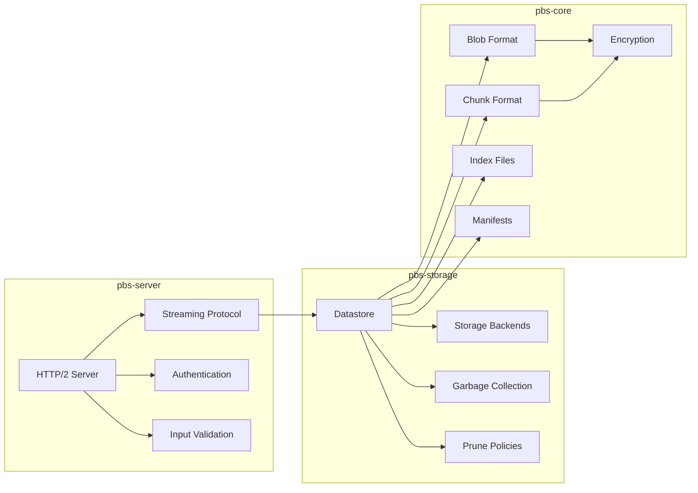
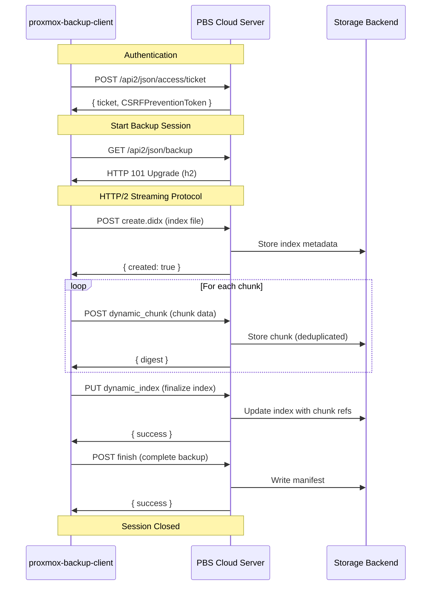
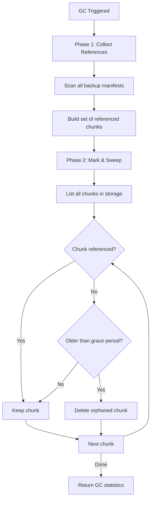
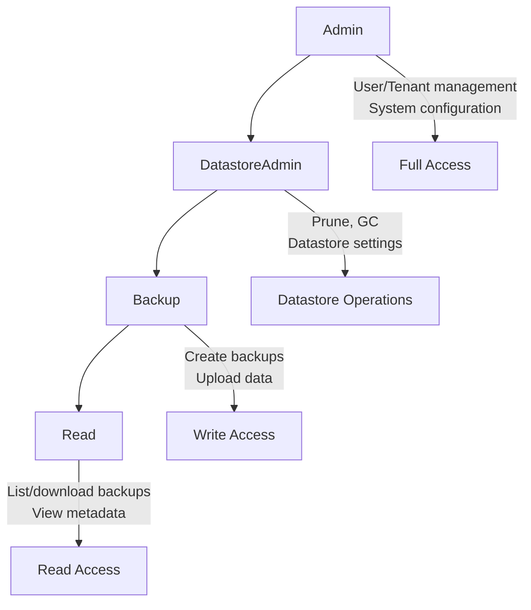
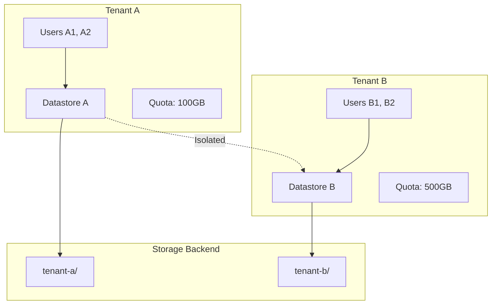

# PBS Cloud

[](https://github.com/haasonsaas/pbs-cloud/actions/workflows/ci.yaml)
[](https://opensource.org/licenses/MIT)
[](https://www.rust-lang.org)

A PBS-compatible backup server with S3 storage, multi-tenancy, and compliance features.

## Overview

PBS Cloud is a clean-room implementation of a backup server compatible with [Proxmox Backup Server](https://www.proxmox.com/en/proxmox-backup-server) clients. It implements the documented PBS protocols and file formats, enabling:

- **S3-Compatible Storage**: Store backups in any S3-compatible object storage (AWS S3, MinIO, Cloudflare R2, etc.)
- **Local Storage**: Traditional filesystem-based storage with the same PBS layout
- **Multi-Tenancy**: Isolated datastores per tenant with usage tracking and billing hooks
- **Drop-in Compatibility**: Works with the stock `proxmox-backup-client`

## Terminology

- **Backend**: The physical storage provider (local filesystem, S3-compatible object storage).
- **Datastore**: A named PBS store within a backend (`store` parameter in API/CLI).
- **Namespace**: A logical sub-tree under a datastore (`ns/` prefixes on disk).
- **Repository**: The client URL `user@host:store` (set via `PBS_REPOSITORY`).

## Features

### Core

- [x] PBS-compatible data formats (blobs, chunks, indexes)
- [x] Content-addressable chunk storage with SHA-256
- [x] Fixed and dynamic chunking (for VMs and file archives)
- [x] AES-256-GCM encryption + zstd compression
- [x] S3 storage backend
- [x] Local filesystem storage backend
- [x] Namespaces (`ns/` prefixes)
- [x] Multiple datastores per backend (`store` parameter)
- [x] Full HTTP/2 streaming backup protocol
- [x] TLS/HTTPS with rustls (self-signed or custom certs)
- [x] Multi-tenant management with usage tracking
- [x] API token authentication (PBS-compatible)
- [x] Role-based permissions (Admin, DatastoreAdmin, Backup, Read)
- [x] Garbage collection for orphaned chunks
- [x] Prune policies (keep-last, daily, weekly, monthly, yearly)
- [x] Billing webhooks for usage events
- [x] Prometheus metrics export
- [x] Per-IP and per-tenant rate limiting
- [x] Persistent state (users, tokens, tenants)
- [x] Quota enforcement per tenant

### Roadmap

- [x] Encryption key management (env-configured)
- [x] WORM/immutable backups
- [x] Compliance reporting
- [x] Webhook signature verification

## Compatibility & Limits (read this first)

PBS Cloud targets **PBS protocol compatibility** and is focused on the APIs used by
`proxmox-backup-client`. It is not a full PBS clone.

**What’s verified today**
- Unit and integration tests for protocol/data formats and server APIs.
- Optional end-to-end smoke test (`scripts/pbs_client_smoke.sh`) runs `proxmox-backup-client`
  backup → list → restore when the client binary is available (CI skips if missing).

**Tested client versions**
- Reported by the smoke test (`proxmox-backup-client --version`) when run in CI or locally.

**Compatibility matrix**

| Area | Status | Notes |
|------|--------|-------|
| Backup protocol | ✅ | HTTP/2 upgrade + PBS data formats implemented |
| Restore protocol | ✅ | Reader endpoints implemented |
| Verification jobs | ✅ | Schedule + history endpoints implemented |
| GC / Prune | ✅ | Core behavior present; see “GC safety” below |
| Tape / Sync / Remote | ❌ | Not implemented |
| PBS UI / Node admin | ❌ | Not implemented (API subset only) |

**Known gaps / intentional differences**
- Admin/REST surface is a focused subset of PBS APIs (verify jobs supported; other job types and UI endpoints are not).
- Namespace comments are not persisted (`comment` always `null`).
- Datastore `total`/`avail` are synthetic for backends without capacity reporting.
- Server-managed encryption is global (env-only) with no rotation or per-tenant keys.

If you need specific PBS endpoints, open an issue or PR with the upstream reference.

## Security posture (defaults)

PBS Cloud aims to be safe by default for multi-tenant use:

- **Metrics** (`/metrics`) are **disabled by default**. Enable explicitly via `PBS_METRICS_PUBLIC=1`
  or use the admin-protected `/api2/json/metrics`.
- **Root dashboard** (`/`) is **disabled by default**. Enable with `PBS_DASHBOARD_ENABLED=1`.
- Rate limiting is enabled by default (per-IP + per-tenant).

## Encryption model

PBS Cloud supports both:

- **Client-side encryption** (PBS DataBlob encrypted before upload). The server stores encrypted
  blobs as-is.
- **Server-managed at-rest encryption** (via `PBS_ENCRYPTION_KEY`/`PBS_ENCRYPTION_KEY_FILE`).

Important notes:
- Server-managed encryption is **global**, not per-tenant.
- If the server does not have the decryption key for a client-encrypted blob, it cannot verify
  chunk contents (integrity checks are skipped for those blobs).
- There is no key rotation support yet.

## GC & prune safety

GC builds a reachable chunk set by scanning manifests and then sweeps storage for orphans.
This provides correctness for **completed** backups, but there is no lease/epoch protocol yet to
prevent races with in-flight writes.

Recommendation: schedule GC during low-traffic windows and avoid running it concurrently with
large ingest jobs until an explicit lease mechanism is implemented.

For more detail on crash behavior, partial uploads, and object storage semantics, see
`docs/durability.md`.

## Architecture



### Crate Structure



## Backup Protocol Flow

The PBS backup protocol uses HTTP/2 with a streaming upgrade for efficient data transfer:



## Garbage Collection

PBS Cloud includes automatic garbage collection to remove orphaned chunks:



## Quick Start

### Prerequisites

- Rust 1.88+
- S3-compatible storage (or use local filesystem)

### Build

```bash
cargo build --release
```

### Run with Local Storage

```bash
export PBS_DATA_DIR=/var/lib/pbs-cloud
./target/release/pbs-cloud-server
```

Open `http://localhost:8007/` for a lightweight status dashboard and quick API links
(enable with `PBS_DASHBOARD_ENABLED=1`).

### Run with S3 Storage

```bash
export AWS_ACCESS_KEY_ID=your-key
export AWS_SECRET_ACCESS_KEY=your-secret
export PBS_S3_BUCKET=your-bucket
export PBS_S3_REGION=us-east-1
# Optional: PBS_S3_ENDPOINT=https://minio.example.com for non-AWS S3

./target/release/pbs-cloud-server
```

On first run, the server will create a root user and display the API token:

```
INFO Created root user: root@pam
INFO Root API token: pbs_abc123...
INFO Save this token - it won't be shown again!
```

For production (especially Kubernetes), consider setting `PBS_ROOT_TOKEN_FILE` to write the token
to a file and/or `PBS_PRINT_ROOT_TOKEN=0` to avoid long-lived log exposure.

### Use with proxmox-backup-client

```bash
# Set the repository (adjust hostname as needed)
export PBS_REPOSITORY="root@pam!root-token@localhost:8007:default"

# If using self-signed TLS, set the fingerprint (sha256, colon-separated)
# export PBS_FINGERPRINT="aa:bb:cc:..."

# Use a non-default datastore
# export PBS_REPOSITORY="root@pam!root-token@localhost:8007:archive"

# Create a backup
proxmox-backup-client backup root.pxar:/

# List backups
proxmox-backup-client list

# Restore
proxmox-backup-client restore host/hostname/2024-01-01T00:00:00Z root.pxar /restore/path
```

## Configuration

### Environment Variables

| Variable | Description | Default |
|----------|-------------|---------|
| **Server** | | |
| `PBS_LISTEN_ADDR` | Server listen address | `0.0.0.0:8007` |
| `PBS_METRICS_PUBLIC` | Expose `/metrics` without auth (`true`/`1`) | `false` |
| `PBS_DASHBOARD_ENABLED` | Enable root status dashboard (`true`/`1`) | `false` |
| `PBS_PRINT_ROOT_TOKEN` | Print root token on first boot (`true`/`1`) | `true` |
| `PBS_ROOT_TOKEN_FILE` | Write root token to a file on first boot | - |
| **Storage** | | |
| `PBS_DATA_DIR` | Local storage path (also used for persistence if not set separately) | `/var/lib/pbs-cloud` |
| `PBS_PERSISTENCE_DIR` | Directory for persisting users/tokens/tenants | Same as `PBS_DATA_DIR` |
| `PBS_S3_BUCKET` | S3 bucket name (enables S3 storage) | - |
| `PBS_S3_REGION` | AWS region | - |
| `PBS_S3_ENDPOINT` | S3 endpoint URL (for MinIO, R2, etc.) | - |
| `PBS_S3_PREFIX` | Key prefix in bucket | - |
| `PBS_DATASTORES` | Comma-separated additional datastore names | - |
| **Tenants** | | |
| `PBS_DEFAULT_TENANT` | Default tenant ID | `default` |
| **TLS** | | |
| `PBS_TLS_DISABLED` | Disable TLS (set to any value) | - |
| `PBS_TLS_CERT` | Path to TLS certificate | - (uses self-signed) |
| `PBS_TLS_KEY` | Path to TLS private key | - (uses self-signed) |
| **Garbage Collection** | | |
| `PBS_GC_DISABLED` | Disable automatic GC (set to any value) | - |
| `PBS_GC_INTERVAL_HOURS` | Hours between GC runs | `24` |
| **WORM / Immutability** | | |
| `PBS_WORM_ENABLED` | Enable WORM retention enforcement (`true`/`1`) | `false` |
| `PBS_WORM_RETENTION_DAYS` | Default retention period in days | - |
| `PBS_WORM_ALLOW_OVERRIDE` | Allow per-backup retention override | `false` |
| **Webhook Verification** | | |
| `PBS_WEBHOOK_RECEIVER_SECRET` | HMAC secret for inbound webhook verification | - |
| **Encryption** | | |
| `PBS_ENCRYPTION_KEY` | Hex-encoded 32-byte key for server-managed encryption | - |
| `PBS_ENCRYPTION_KEY_FILE` | Path to a file containing the hex key | - |

### TLS Configuration

By default, PBS Cloud generates a self-signed certificate. For production:

```bash
# Use custom certificates
export PBS_TLS_CERT=/path/to/cert.pem
export PBS_TLS_KEY=/path/to/key.pem

# Or disable TLS entirely (not recommended for production)
export PBS_TLS_DISABLED=1
```

### Rate Limiting

Rate limiting is enabled by default to protect against abuse:

- **Per-IP**: 100 requests/second burst, 10 requests/second sustained
- **Per-Tenant**: 1000 requests/second burst, 100 requests/second sustained

### Health Checks

For Kubernetes or load balancer health checks:

| Endpoint | Description |
|----------|-------------|
| `GET /health` or `GET /healthz` | Liveness probe - returns 200 if server is running |
| `GET /ready` or `GET /readyz` | Readiness probe - returns 200 if datastores are configured |
| `GET /api2/json/ping` | PBS API ping (returns `{ pong: true }`) |

```bash
# Check health
curl https://localhost:8007/health

# Check readiness
curl https://localhost:8007/ready
```

### Status & Tasks

```bash
# Status root (PBS-compatible subdir list; includes a `summary` field)
curl -H "Authorization: PBSAPIToken=root@pam!root:pbs_..." \
  https://localhost:8007/api2/json/status

# Datastore usage summary (PBS-compatible)
curl -H "Authorization: PBSAPIToken=root@pam!root:pbs_..." \
  https://localhost:8007/api2/json/status/datastore-usage

# Node status (basic)
curl -H "Authorization: PBSAPIToken=root@pam!root:pbs_..." \
  https://localhost:8007/api2/json/nodes/localhost/status

# Task list
curl -H "Authorization: PBSAPIToken=root@pam!root:pbs_..." \
  https://localhost:8007/api2/json/nodes/localhost/tasks
```

## API Reference

### Authentication

```bash
# Get a ticket (use your root token in the password field)
curl -X POST https://localhost:8007/api2/json/access/ticket \
  -d '{"username":"root@pam","password":"pbs_abc123..."}'

# List effective permissions
curl -H "Authorization: PBSAPIToken=root@pam!root:pbs_..." \
  https://localhost:8007/api2/json/access/permissions
```

### Tenant Management (Admin only)

```bash
# List tenants
curl -H "Authorization: PBSAPIToken=root@pam!root:pbs_..." \
  https://localhost:8007/api2/json/tenants

# Create tenant with quota
curl -X POST -H "Authorization: PBSAPIToken=root@pam!root:pbs_..." \
  -H "Content-Type: application/json" \
  https://localhost:8007/api2/json/tenants \
  -d '{"name": "Acme Corp", "quota_bytes": 107374182400}'
```

### User & Token Management

```bash
# Create a new user
curl -X POST -H "Authorization: PBSAPIToken=root@pam!root:pbs_..." \
  -H "Content-Type: application/json" \
  https://localhost:8007/api2/json/access/users \
  -d '{"username":"backup@pam","tenant_id":"default","permission":"backup"}'

# Create an API token
curl -X POST -H "Authorization: PBSAPIToken=root@pam!root:pbs_..." \
  -H "Content-Type: application/json" \
  https://localhost:8007/api2/json/access/tokens \
  -d '{"name":"my-backup-token","permission":"backup"}'
```

### Garbage Collection (Admin only)

```bash
# Trigger manual GC
curl -X POST -H "Authorization: PBSAPIToken=root@pam!root:pbs_..." \
  https://localhost:8007/api2/json/admin/gc

# Check GC status
curl -H "Authorization: PBSAPIToken=root@pam!root:pbs_..." \
  https://localhost:8007/api2/json/admin/gc/status

# Prune old backups
curl -X POST -H "Authorization: PBSAPIToken=root@pam!root:pbs_..." \
  -H "Content-Type: application/json" \
  https://localhost:8007/api2/json/admin/prune \
  -d '{"keep_last": 3, "keep_daily": 7, "keep_weekly": 4}'
```

### Billing & Usage

```bash
# Get usage for current tenant
curl -H "Authorization: PBSAPIToken=root@pam!root:pbs_..." \
  https://localhost:8007/api2/json/billing/usage
```

### Compliance Report (Admin only)

```bash
# Get compliance report (snapshot retention summary)
curl -H "Authorization: PBSAPIToken=root@pam!root:pbs_..." \
  https://localhost:8007/api2/json/compliance/report
```

## Compliance scope

- The compliance report is a **retention summary**, not a certified audit or regulatory attestation.
- WORM enforcement prevents deletion within the configured retention window but does **not** provide
  legal-hold guarantees unless your backend provides object lock or versioning.

### Prometheus Metrics

Metrics are **disabled by default** for unauthenticated access. Enable public metrics with
`PBS_METRICS_PUBLIC=1` or use the admin-protected `/api2/json/metrics`.

```bash
# Public metrics (when PBS_METRICS_PUBLIC=1)
curl https://localhost:8007/metrics

# Authenticated metrics
curl -H "Authorization: PBSAPIToken=root@pam!root:pbs_..." \
  https://localhost:8007/api2/json/metrics
```

Available metrics:
- `pbs_backup_bytes_total` - Total bytes backed up
- `pbs_restore_bytes_total` - Total bytes restored
- `pbs_active_sessions` - Current active backup/restore sessions
- `pbs_requests_total` - HTTP requests by endpoint and status
- `pbs_request_duration_seconds` - Request latency histogram

### Webhook Integration

Configure webhooks to receive usage events for billing integration:

```json
{
  "url": "https://billing.example.com/webhook",
  "secret": "your-hmac-secret",
  "event_filter": ["backup_created", "storage_updated"]
}
```

Events include:
- `backup_created` - New backup completed
- `backup_deleted` - Backup removed
- `data_restored` - Data downloaded
- `storage_updated` - Storage usage changed
- `api_request` - API call made

### Webhook Signature Verification

Inbound webhook verification is available at:

```bash
curl -X POST https://localhost:8007/api2/json/billing/webhook \
  -H "X-Signature-256: sha256=<hex-hmac>" \
  -d '{"event":"test"}'
```

## Verification Jobs

Verification jobs are configured via `/api2/json/config/verify` and can run on a schedule or interval
(`PBS_VERIFY_INTERVAL_HOURS`). Schedules use the PBS calendar event format:

Examples:
- `daily 02:00 UTC`
- `mon..fri 8..17:0/15 America/New_York`
- `*-*-last 03:00 UTC` (last day of month)
- `jan-15 02:00 UTC` or `2025-01-15 02:00 UTC`

Supported timezone formats:
- `UTC`, `+02:00`, `-0500`
- `local`
- Named TZ database identifiers like `America/Los_Angeles` (or `TZ=America/Los_Angeles`)

## Permissions



| Level | Capabilities |
|-------|-------------|
| `read` | View backups, download data |
| `backup` | Create backups + read |
| `datastore_admin` | Manage datastores (prune, GC) + backup |
| `admin` | Full access including user/tenant management |

## Multi-Tenancy

PBS Cloud provides complete tenant isolation:



- **Data Isolation**: Each tenant's data is stored in separate namespace
- **Session Isolation**: Backup sessions are verified against tenant ownership
- **Quota Enforcement**: Per-tenant storage limits with HTTP 507 on quota exceeded
- **Usage Tracking**: Independent billing and metrics per tenant

## Security

### Input Validation

All user inputs are validated against strict patterns:
- Backup IDs: alphanumeric with `-`, `_`, `.`
- Filenames: Safe characters only, no path traversal
- Datastore names: alphanumeric with `-`, `_`

### Rate Limiting

Protects against:
- Brute-force authentication attempts
- DoS attacks
- Resource exhaustion

### Session Security

- Sessions bound to authenticated tenant
- Cross-tenant access blocked with HTTP 403
- Session expiration and cleanup

## Testing

```bash
# Run all tests
./scripts/test.sh

# Full local CI-style check (fmt + clippy + build + tests + helm lint)
./scripts/ci.sh

# Optional: proxmox-backup-client end-to-end smoke test (skips if client missing)
./scripts/pbs_client_smoke.sh

# Run with output
./scripts/test.sh -- --nocapture

# Run specific test
./scripts/test.sh test_path_traversal
```

Note: the scripts set `TMPDIR` and `CARGO_HOME` under `target/` to avoid issues on low-space systems.

## CLI

PBS Cloud includes a lightweight CLI for common API interactions.

```bash
# Build
cargo build -p pbs-cli

# Binary name: pbs-cloud (server binary is pbs-cloud-server)

# Ping (no auth required)
./target/debug/pbs-cloud --url https://localhost:8007 ping

# List datastores
./target/debug/pbs-cloud --token "$PBS_API_TOKEN" datastores list

# Task list
./target/debug/pbs-cloud --token "$PBS_API_TOKEN" tasks list --limit 20

# Verify jobs
./target/debug/pbs-cloud --token "$PBS_API_TOKEN" verify list
```

Environment variables:
- `PBS_API_URL` (default `https://localhost:8007`)
- `PBS_API_TOKEN`

## License

MIT

## Disclaimer

This is a clean-room implementation based on publicly documented protocols. It is not affiliated with or endorsed by Proxmox Server Solutions GmbH.
