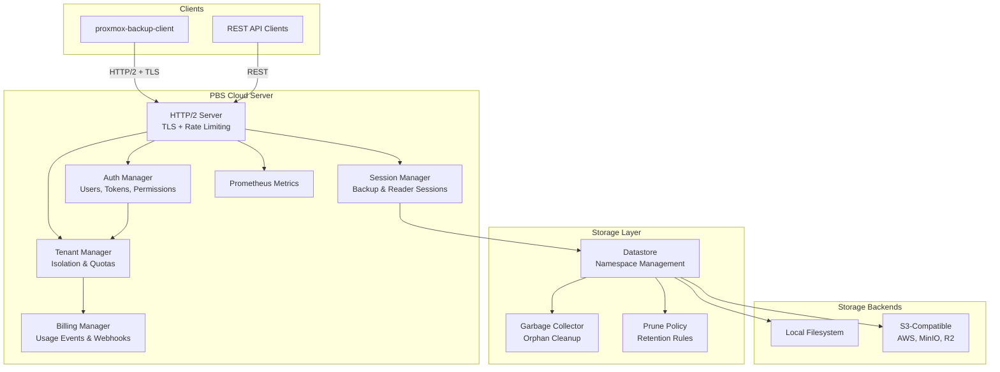
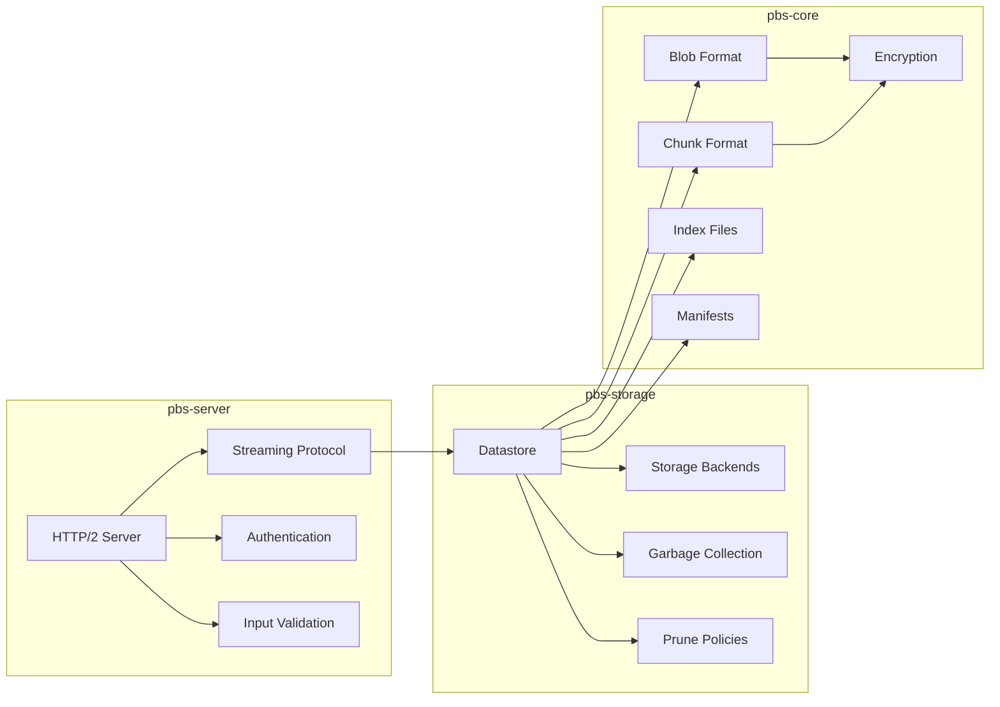
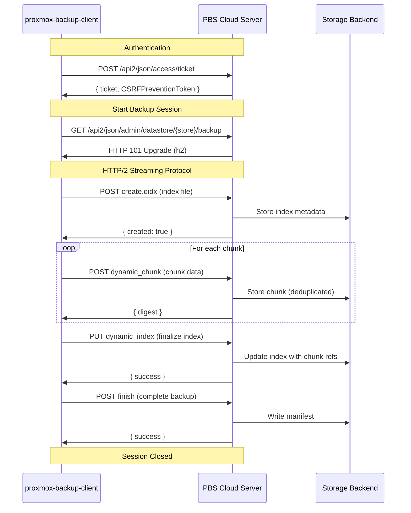
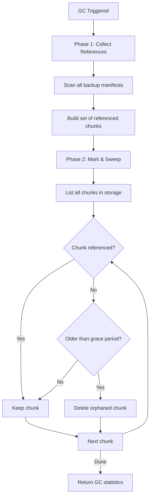
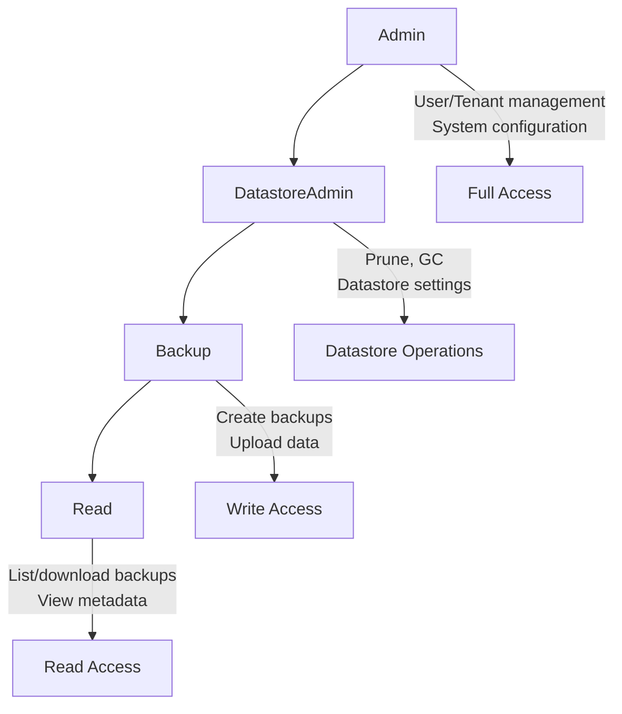

# PBS Cloud

A PBS-compatible backup server with S3 storage, multi-tenancy, and compliance features.

## Overview

PBS Cloud is a clean-room implementation of a backup server compatible with [Proxmox Backup Server](https://www.proxmox.com/en/proxmox-backup-server) clients. It implements the documented PBS protocols and file formats, enabling:

- **S3-Compatible Storage**: Store backups in any S3-compatible object storage (AWS S3, MinIO, Cloudflare R2, etc.)
- **Local Storage**: Traditional filesystem-based storage with the same PBS layout
- **Multi-Tenancy**: Isolated datastores per tenant with usage tracking and billing hooks
- **Drop-in Compatibility**: Works with the stock `proxmox-backup-client`

## Features

### Core

- [x] PBS-compatible data formats (blobs, chunks, indexes)
- [x] Content-addressable chunk storage with SHA-256
- [x] Fixed and dynamic chunking (for VMs and file archives)
- [x] AES-256-GCM encryption + zstd compression
- [x] S3 storage backend
- [x] Local filesystem storage backend
- [x] Full HTTP/2 streaming backup protocol
- [x] TLS/HTTPS with rustls (self-signed or custom certs)
- [x] Multi-tenant management with usage tracking
- [x] API token authentication (PBS-compatible)
- [x] Role-based permissions (Admin, DatastoreAdmin, Backup, Read)
- [x] Garbage collection for orphaned chunks
- [x] Prune policies (keep-last, daily, weekly, monthly, yearly)
- [x] Billing webhooks for usage events
- [x] Prometheus metrics export
- [x] Per-IP and per-tenant rate limiting
- [x] Persistent state (users, tokens, tenants)
- [x] Quota enforcement per tenant

### Roadmap

- [ ] Encryption key management
- [ ] WORM/immutable backups
- [ ] Compliance reporting
- [ ] Webhook signature verification

## Architecture



### Crate Structure



## Backup Protocol Flow

The PBS backup protocol uses HTTP/2 with a streaming upgrade for efficient data transfer:



## Garbage Collection

PBS Cloud includes automatic garbage collection to remove orphaned chunks:



## Quick Start

### Prerequisites

- Rust 1.75+
- S3-compatible storage (or use local filesystem)

### Build

```bash
cargo build --release
```

### Run with Local Storage

```bash
export PBS_DATA_DIR=/var/lib/pbs-cloud
./target/release/pbs-cloud-server
```

### Run with S3 Storage

```bash
export AWS_ACCESS_KEY_ID=your-key
export AWS_SECRET_ACCESS_KEY=your-secret
export PBS_S3_BUCKET=your-bucket
export PBS_S3_REGION=us-east-1
# Optional: PBS_S3_ENDPOINT=https://minio.example.com for non-AWS S3

./target/release/pbs-cloud-server
```

On first run, the server will create a root user and display the API token:

```
INFO Created root user: root@pam
INFO Root API token: pbs_abc123...
INFO Save this token - it won't be shown again!
```

### Use with proxmox-backup-client

```bash
# Set the repository (adjust hostname as needed)
export PBS_REPOSITORY="root@pam!root-token@localhost:8007:default"

# Create a backup
proxmox-backup-client backup root.pxar:/

# List backups
proxmox-backup-client list

# Restore
proxmox-backup-client restore host/hostname/2024-01-01T00:00:00Z root.pxar /restore/path
```

## Configuration

### Environment Variables

| Variable | Description | Default |
|----------|-------------|---------|
| `PBS_LISTEN_ADDR` | Server listen address | `0.0.0.0:8007` |
| `PBS_DATA_DIR` | Local storage path | `/var/lib/pbs-cloud` |
| `PBS_S3_BUCKET` | S3 bucket name | - |
| `PBS_S3_REGION` | AWS region | `us-east-1` |
| `PBS_S3_ENDPOINT` | S3 endpoint URL (for MinIO, R2, etc.) | - |
| `PBS_S3_PREFIX` | Key prefix in bucket | - |
| `PBS_DEFAULT_TENANT` | Default tenant ID | `default` |
| `PBS_GC_ENABLED` | Enable automatic garbage collection | `true` |
| `PBS_GC_INTERVAL_HOURS` | Hours between GC runs | `24` |

### TLS Configuration

By default, PBS Cloud generates a self-signed certificate. For production:

```bash
# Use custom certificates
export PBS_TLS_CERT=/path/to/cert.pem
export PBS_TLS_KEY=/path/to/key.pem
```

### Rate Limiting

Rate limiting is enabled by default to protect against abuse:

- **Per-IP**: 100 requests/second burst, 10 requests/second sustained
- **Per-Tenant**: 1000 requests/second burst, 100 requests/second sustained

## API Reference

### Authentication

```bash
# Get a ticket (use your root token in the password field)
curl -X POST https://localhost:8007/api2/json/access/ticket \
  -d '{"username":"root@pam","password":"pbs_abc123..."}'
```

### Tenant Management (Admin only)

```bash
# List tenants
curl -H "Authorization: PBSAPIToken=root@pam!root:pbs_..." \
  https://localhost:8007/api2/json/tenants

# Create tenant with quota
curl -X POST -H "Authorization: PBSAPIToken=root@pam!root:pbs_..." \
  -H "Content-Type: application/json" \
  https://localhost:8007/api2/json/tenants \
  -d '{"name": "Acme Corp", "quota_bytes": 107374182400}'
```

### User & Token Management

```bash
# Create a new user
curl -X POST -H "Authorization: PBSAPIToken=root@pam!root:pbs_..." \
  -H "Content-Type: application/json" \
  https://localhost:8007/api2/json/access/users \
  -d '{"username":"backup@pam","tenant_id":"default","permission":"backup"}'

# Create an API token
curl -X POST -H "Authorization: PBSAPIToken=root@pam!root:pbs_..." \
  -H "Content-Type: application/json" \
  https://localhost:8007/api2/json/access/tokens \
  -d '{"name":"my-backup-token","permission":"backup"}'
```

### Garbage Collection (Admin only)

```bash
# Trigger manual GC
curl -X POST -H "Authorization: PBSAPIToken=root@pam!root:pbs_..." \
  https://localhost:8007/api2/json/admin/gc

# Check GC status
curl -H "Authorization: PBSAPIToken=root@pam!root:pbs_..." \
  https://localhost:8007/api2/json/admin/gc/status

# Prune old backups
curl -X POST -H "Authorization: PBSAPIToken=root@pam!root:pbs_..." \
  -H "Content-Type: application/json" \
  https://localhost:8007/api2/json/admin/prune \
  -d '{"keep_last": 3, "keep_daily": 7, "keep_weekly": 4}'
```

### Billing & Usage

```bash
# Get usage for current tenant
curl -H "Authorization: PBSAPIToken=root@pam!root:pbs_..." \
  https://localhost:8007/api2/json/billing/usage
```

### Prometheus Metrics

```bash
# Scrape metrics (no auth required)
curl https://localhost:8007/metrics
```

Available metrics:
- `pbs_backup_bytes_total` - Total bytes backed up
- `pbs_restore_bytes_total` - Total bytes restored
- `pbs_active_sessions` - Current active backup/restore sessions
- `pbs_requests_total` - HTTP requests by endpoint and status
- `pbs_request_duration_seconds` - Request latency histogram

### Webhook Integration

Configure webhooks to receive usage events for billing integration:

```json
{
  "url": "https://billing.example.com/webhook",
  "secret": "your-hmac-secret",
  "event_filter": ["backup_created", "storage_updated"]
}
```

Events include:
- `backup_created` - New backup completed
- `backup_deleted` - Backup removed
- `data_restored` - Data downloaded
- `storage_updated` - Storage usage changed
- `api_request` - API call made

## Permissions



| Level | Capabilities |
|-------|-------------|
| `read` | View backups, download data |
| `backup` | Create backups + read |
| `datastore_admin` | Manage datastores (prune, GC) + backup |
| `admin` | Full access including user/tenant management |

## Multi-Tenancy

PBS Cloud provides complete tenant isolation:

```mermaid
graph TB
    subgraph "Tenant A"
        UA[Users A1, A2]
        DA[Datastore A]
        QA[Quota: 100GB]
    end

    subgraph "Tenant B"
        UB[Users B1, B2]
        DB[Datastore B]
        QB[Quota: 500GB]
    end

    subgraph "Storage Backend"
        SA[/tenant-a/*]
        SB[/tenant-b/*]
    end

    UA --> DA
    UB --> DB
    DA --> SA
    DB --> SB

    DA -.->|Isolated| DB
```

- **Data Isolation**: Each tenant's data is stored in separate namespace
- **Session Isolation**: Backup sessions are verified against tenant ownership
- **Quota Enforcement**: Per-tenant storage limits with HTTP 507 on quota exceeded
- **Usage Tracking**: Independent billing and metrics per tenant

## Security

### Input Validation

All user inputs are validated against strict patterns:
- Backup IDs: alphanumeric with `-`, `_`, `.`
- Filenames: Safe characters only, no path traversal
- Datastore names: alphanumeric with `-`, `_`

### Rate Limiting

Protects against:
- Brute-force authentication attempts
- DoS attacks
- Resource exhaustion

### Session Security

- Sessions bound to authenticated tenant
- Cross-tenant access blocked with HTTP 403
- Session expiration and cleanup

## Testing

```bash
# Run all tests
cargo test

# Run with output
cargo test -- --nocapture

# Run specific test
cargo test test_path_traversal
```

## License

MIT OR Apache-2.0

## Disclaimer

This is a clean-room implementation based on publicly documented protocols. It is not affiliated with or endorsed by Proxmox Server Solutions GmbH.
